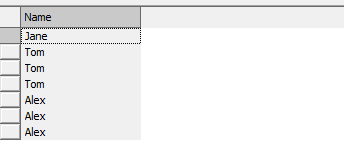

# About
**UNION**, **EXCEPT**, and **INTERSECT** are operators that operate similarly and are used between two queries to form Boolean combinations between the results of the two queries.

Tables returned by UNION, EXCEPT and INTERSECT by default will have duplicate records eliminated.  Use **ALL** to retain duplicates in the results table.

## Data for future examples
Table "Students"  
  
Table "Invoices"  


# UNION
UNION returns all records returned by either A or B.

## Query
```
<SELECT query> UNION <query>
```
```
<SELECT query> UNION ALL <query>
```
## Example
```
SELECT Name FROM Invoices
UNION 
SELECT Name FROM Students;
```
Result:  
  
```
SELECT Name FROM Invoices
UNION ALL
SELECT Name FROM Students;
```
Result:  


# EXCEPT
EXCEPT returns all records in A but not in B.

## Query
```
<SELECT query> EXCEPT <query>
```
```
<SELECT query> EXCEPT ALL <query>
```
## Example
```
SELECT Name FROM Invoices
EXCEPT 
SELECT Name FROM Students;
```
Result:  

```
SELECT Name FROM Invoices
EXCEPT ALL
SELECT Name FROM Students;
```
Result:  


# INTERSECT
INTERSECT returns all records returned by both A and also by B.

## Query
```
<SELECT query> INTERSECT <query>
```
```
<SELECT query> INTERSECT ALL <query>
```
## Example
```
SELECT Name FROM Invoices
INTERSECT 
SELECT Name FROM Students;
```
Result:  
  
```
SELECT Name FROM Invoices
INTERSECT ALL
SELECT Name FROM Students;
```
Result:  


# Source
1. [Manifold: UNION / EXCEPT / INTERSECT](https://manifold.net/doc/mfd9/union___except___intersect.htm) [en]