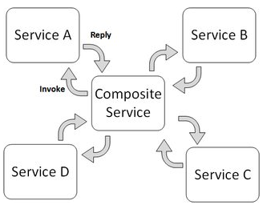
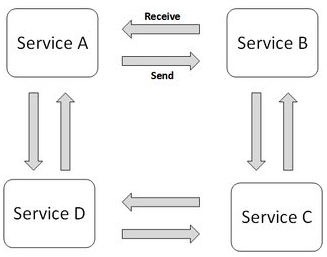

# About
There are two ways of building MSA:
1. Service orchestration
2. Service Choreography

## Service Orchestration
Service orchestration represents a single centralized executable business process (the orchestrator) that coordinates the interaction among different services. The orchestrator is responsible for invoking and combining the services.

The relationship between all the participating services are described by a single endpoint (i.e., the composite service). The orchestration includes the management of transactions between individual services. Orchestration employs a centralized approach for service composition.

## Service Choreography
Service choreography is a global description of the participating services, which is defined by exchange of messages, rules of interaction and agreements between two or more endpoints. Choreography employs a decentralized approach for service composition.

The choreography describes the interactions between multiple services, where as orchestration represents control from one party's perspective. This means that a choreography differs from an orchestration with respect to where the logic that controls the interactions between the services involved should reside.

# Sources
1. [Stackoverflow: Orchestration vs. Choreography] (https://stackoverflow.com/questions/4127241/orchestration-vs-choreography) [eng]