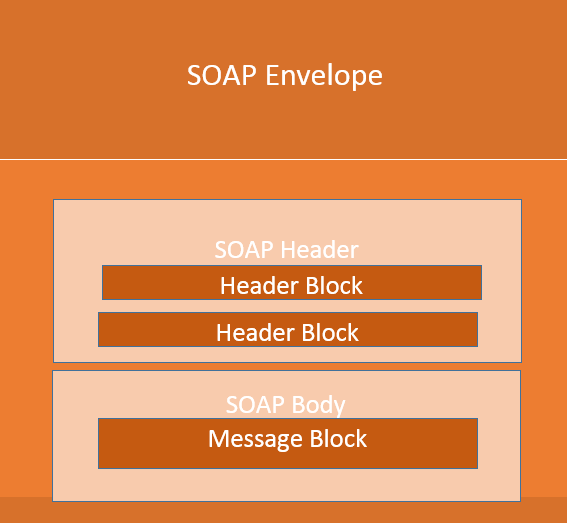
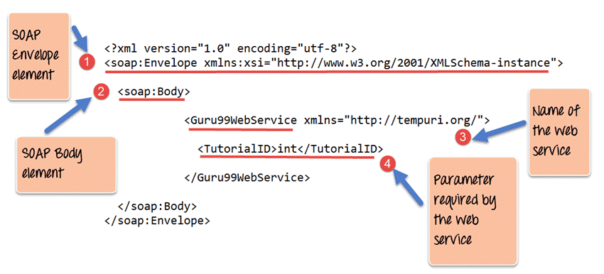

# SOAP
## What is SOAP?
SOAP is an **XML-based** protocol for accessing web services **over HTTP**. It has some specification which could be used across all applications.

### Markup
Only [XML](https://github.com/GorVad/system-data-analyst-notes/blob/main/markup/XML/XML.md)

### Protocols
- HTTP
- SMTP
- TCP
- FTP
- _etc..._

!**TBD:** Link to protocols!

## SOAP Building Blocks


## SOAP Message Structure
- The Envelope element
- The header element and
- The body element
- The Fault element (Optional)


# WSDL
## What is WSDL?
Web Services Description Language (WSDL) is an XML-based file that basically tells the client application what the web service does. The WSDL file is used to describe in a nutshell what the web service does and gives the client all the information required to connect to the web service and use all the functionality provided by the web service.

## WSDL Elements
- **The types tag** is used to define all the complex datatypes, which will be used in the message exchanged between the client application and the web service. 
- **The messages tag** is used to define the message which is exchanged between the client application and the web server. 
- **The portType tag** is used to encapsulate every input and output message into one logical operation. 
- **The binding tag** is used to bind the operation to the particular port type. This is so that when the client application calls the relevant port type, it will then be able to access the operations which are bound to this port type. Port types are just like interfaces. 
- **The service tag** is a name given to the web service itself. Initially, when a client application makes a call to the web service, it will do by calling the name of the web service.  

## WSDL Example
````
<?xml version="1.0"?>
<definitions name="Tutorial"             
		targetNamespace=http://Guru99.com/Tutorial.wsdl           
        xmlns:tns=http://Guru99.com/Tutorial.wsdl            
        xmlns:xsd1=http://Guru99.com/Tutorial.xsd           
        xmlns:soap=http://schemas.xmlsoap.org/wsdl/soap/
        xmlns="http://schemas.xmlsoap.org/wsdl/"> 
   <types>    
   		<schema targetNamespace=http://Guru99.com/Tutorial.xsd    
        xmlns="http://www.w3.org/2000/10/XMLSchema">
        
        <element name="TutorialNameRequest">       
        	<complexType>         
            	<all>            
                	<element name="TutorialName" type="string"/>        
                </all>      
            </complexType>     
       </element>    
       <element name="TutorialIDRequest">       
       		<complexType>           
            	<all>           
                	<element name="TutorialID" type="number"/>         
                </all>      
            </complexType>     
       </element>    
    </schema>
 </types>  
 <message name="GetTutorialNameInput">   
 	<part name="body" element="xsd1:TutorialIDRequest"/>  
 </message> 
 <message name="GetTutorialNameOutput">  
 	<part name="body" element="xsd1:TutorialNameRequest"/>
 </message> 
 <portType name="TutorialPortType">  
 	<operation name="GetTutorialName">    
    	<input message="tns:GetTutorialNameInput"/>     
        <output message="tns:GetTutorialNameOutput"/>   
    </operation>  
  </portType> 
  <binding name="TutorialSoapBinding" type="tns:TutorialPortType">  
  <soap:binding style="document" transport="http://schemas.xmlsoap.org/soap/http"/>  
 	 <operation name="GetTutorialName">    
  		<soap:operation soapAction="http://Guru99.com/GetTutorialName"/>   
        	<input>   
            	<soap:body use="literal"/>   
            </input>  
        <output>      
   <soap:body use="literal"/>   
 </output>   
 </operation>  
 </binding>  
 
 <service name="TutorialService">   
 	<documentation>TutorialService</documentation>  
    <port name="TutorialPort" binding="tns:TutorialSoapBinding">     
    	<soap:address location="http://Guru99.com/Tutorial"/>
    </port>
 </service>
</definitions>
````


## Sources
### Web
1. [W3School: SOAP](https://www.w3schools.com/xml/xml_soap.asp)
2. [W3School: WSDL](https://www.w3schools.com/xml/xml_wsdl.asp)
### Articles
1. [Guru99: What is SOAP?](https://www.guru99.com/soap-simple-object-access-protocol.html) [eng]
2. [Guru99L WSDL](https://www.guru99.com/wsdl-web-services-description-language.html) [eng]
3. [The simple guide to WSDL](https://www.tutorialworks.com/wsdl/) [eng]
4. [SOAP (Simple Object Access Protocol)](https://www.techtarget.com/searchapparchitecture/definition/SOAP-Simple-Object-Access-Protocol) [eng]
5. [Alexsoft: What is SOAP: Formats, Protocols, Message Structure, and How SOAP is Different from REST](https://www.altexsoft.com/blog/engineering/what-is-soap-formats-protocols-message-structure-and-how-soap-is-different-from-rest/) [eng]
