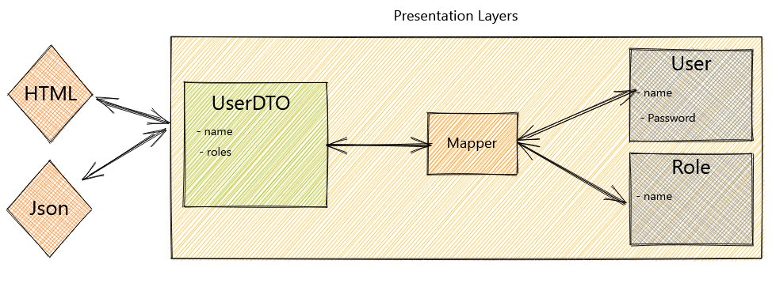

# About
**DTOs or Data Transfer Objects are objects that carry data between processes in order to reduce the number of methods calls.**

Fowler explained that the pattern’s main purpose is to reduce roundtrips to the server by batching up multiple parameters in a single call. This reduces the network overhead in such remote operations.

Another benefit is the encapsulation of the serialization’s logic (the mechanism that translates the object structure and data to a specific format that can be stored and transferred). It provides a single point of change in the serialization nuances. It also decouples the domain models from the presentation layer, allowing both to change independently.

# How to use it
DTOs normally are created as POJOs. They are flat data structures that contain no business logic. They only contain storage, accessors and eventually methods related to serialization or parsing.

The data is mapped from the domain models to the DTOs, normally through a mapper component in the presentation or facade layer.

The image below illustrates the interaction between the components: 


# When to use it
DTOs come in handy in systems with remote calls, as they help to reduce the number of them.

DTOs also help when the domain model is composed of many different objects and the presentation model needs all their data at once, or they can even reduce roundtrip between client and server.

With DTOs, we can build different views from our domain models, allowing us to create other representations of the same domain but optimizing them to the clients’ needs without affecting our domain design. Such flexibility is a powerful tool to solve complex problems.

# Example
## DTO vs Domain
Below is the definition of both models:
```
public class User {

    private String id;
    private String name;
    private String password;
    private List<Role> roles;

    public User(String name, String password, List<Role> roles) {
        this.name = Objects.requireNonNull(name);
        this.password = this.encrypt(password);
        this.roles = Objects.requireNonNull(roles);
    }

    // Getters and Setters

   String encrypt(String password) {
       // encryption logic
   }
}
```
```
public class Role {

    private String id;
    private String name;

    // Constructors, getters and setters
}
```
Now let’s look at the DTOs so that we can compare them with the Domain models.

At this moment, it’s important to notice that the DTO represents the model sent from or to the API client.

Therefore, the small differences are either to pack together the request sent to the server or optimize the response of the client:
```
public class UserDTO {
    private String name;
    private List<String> roles;
    
    // standard getters and setters
}
```
The DTO above provides only the relevant information to the client, hiding the password, for example, for security reasons.

The next DTO groups all the data necessary to create a user and sends it to the server in a single request, which optimizes the interactions with the API:
```
public class UserCreationDTO {

    private String name;
    private String password;
    private List<String> roles;

    // standard getters and setters
}
```
## Connecting Both Sides
Next, the layer that ties both classes uses a mapper component to pass the data from one side to the other and vice versa.

This normally happens in the presentation layer:
```
@RestController
@RequestMapping("/users")
class UserController {

    private UserService userService;
    private RoleService roleService;
    private Mapper mapper;

    // Constructor

    @GetMapping
    @ResponseBody
    public List<UserDTO> getUsers() {
        return userService.getAll()
          .stream()
          .map(mapper::toDto)
          .collect(toList());
    }


    @PostMapping
    @ResponseBody
    public UserIdDTO create(@RequestBody UserCreationDTO userDTO) {
        User user = mapper.toUser(userDTO);

        userDTO.getRoles()
          .stream()
          .map(role -> roleService.getOrCreate(role))
          .forEach(user::addRole);

        userService.save(user);

        return new UserIdDTO(user.getId());
    }

}
```
Last, we have the Mapper component that transfers the data, making sure that both DTO and domain model don’t need to know about each other:
```
@Component
class Mapper {
    public UserDTO toDto(User user) {
        String name = user.getName();
        List<String> roles = user
          .getRoles()
          .stream()
          .map(Role::getName)
          .collect(toList());

        return new UserDTO(name, roles);
    }

    public User toUser(UserCreationDTO userDTO) {
        return new User(userDTO.getName(), userDTO.getPassword(), new ArrayList<>());
    }
}
```

# Sources
1. [Baeldung:The DTO Pattern (Data Transfer Object)](https://www.baeldung.com/java-dto-pattern) [en]
2. [YouTube: What is a DTO? Data Transfer Object](https://www.youtube.com/watch?v=F9M9bUq-0Z0) [en]