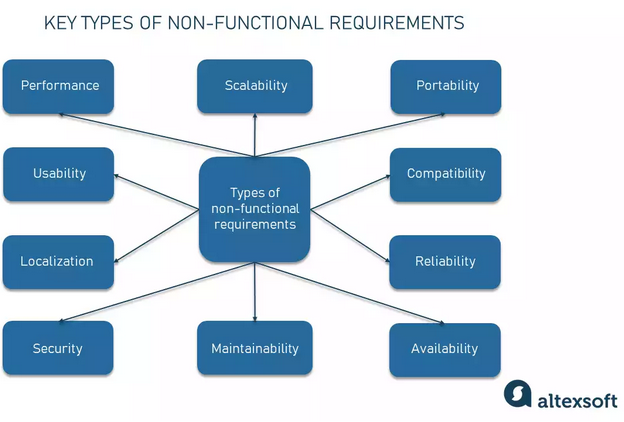
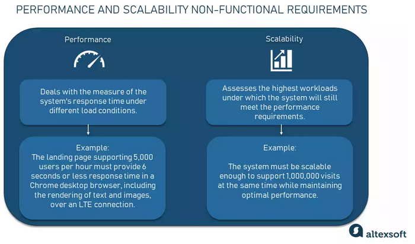
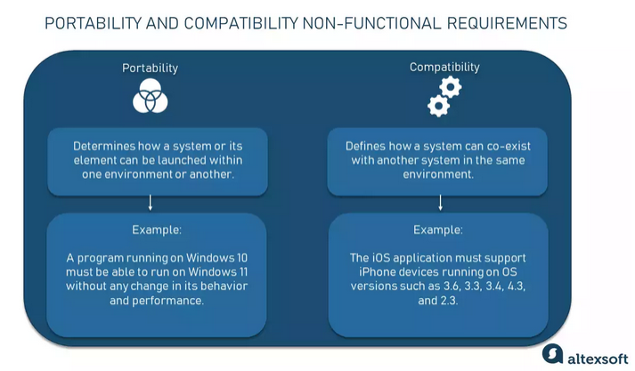
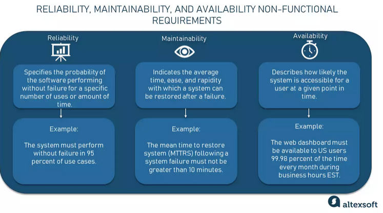
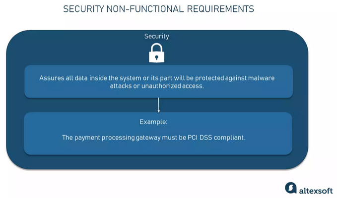
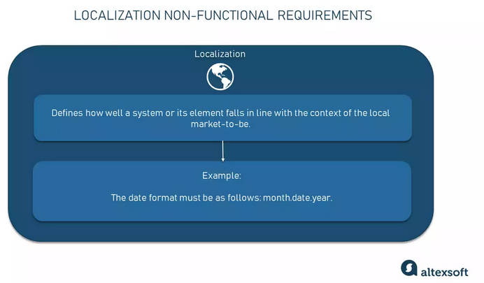
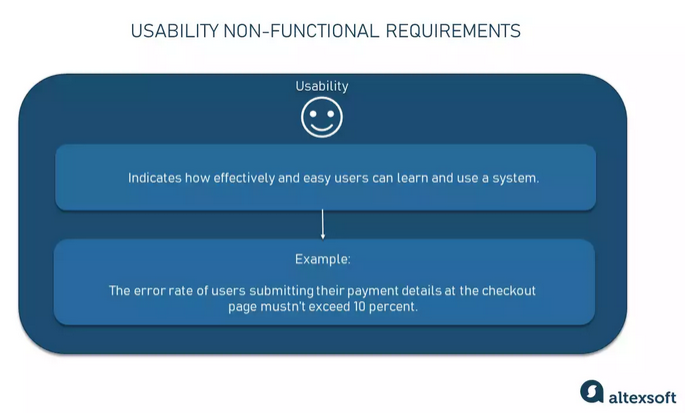

# What is it?
Non-functional requirements specify the quality attributes of the system, hence their second name — quality attributes. Continuing our messaging platform example, a non-functional requirement can be the speed with which a system must perform editing to satisfy user expectations, “The message must be updated for all users in a chat within 0.1 seconds, given that all users are online and have LTE connection or better.”

# Types

## Performance and scalability
Performance and scalability are the two core non-functional requirements no system can do without. Since they go hand in hand, we’ve put them in one section.

_Questions: How fast does the system return results? How much will this performance change with higher workloads?_

### Performance
Defines how fast a software system or a particular piece of it responds to certain users’ actions under a certain workload. In most cases, this metric explains how long a user must wait before the target operation happens (the page renders, a transaction is processed, etc.) given the overall number of users at the moment. But it’s not always like that. Performance requirements may describe background processes invisible to users, e.g. backup. But let’s focus on user-centric performance.  

_Example of performance requirements:  
The landing page supporting 5,000 users per hour must provide 6 second or less response time in a Chrome desktop browser, including the rendering of text and images and over an LTE connection._

### Scalability
Assesses the highest workloads under which the system will still meet the performance requirements. There are two ways to enable your system scale as the workloads get higher: horizontal and vertical scaling.
1. **Horizontal** scaling is provided by adding more machines to the pool of servers.
2. **Vertical** scaling is achieved by adding more CPU and RAM to the existing machines. 

_Example of scalability requirements:  
The system must be scalable enough to support 1,000,000 visits at the same time while maintaining optimal performance._

## Portability and compatibility
Two more key players in the world of non-functional requirements are such attributes as portability and compatibility.
Portability and compatibility are established in terms of operating systems, hardware devices, browsers, software systems, and their versions. For now, a cross-platform, cross-browsing, and mobile-responsive solution is a common standard for web applications.

Portability non-functional requirements are usually based on preliminary market research, field research activities, or analytics reports on the types of software and devices the target audience has. If you are working within a corporate environment and the software will be accessed through a documented list of devices and operating systems, it’s quite easy to define compatibility and portability.  

_Questions: Which hardware, operating systems, and browsers, along with their versions does the software run on? Does it conflict with other applications and processes within these environments?_

### Portability
Determines how a system or its element can be launched within one environment or another. It usually includes hardware, software, or other usage platform specifications. Put simply, it establishes how well actions performed via one platform are run on another. Also, it prescribes how well system elements may be accessed and may interact from two different environments.

_Example of portability requirements:  
A program running on Windows 10 must be able to run on Windows 11 without any change in its behavior and performance._

### Compatibility
As an additional aspect of portability, defines how a system can coexist with another system in the same environment. For instance, software installed on an operating system must be compatible with its firewall or antivirus protection.

_Example of compatibility requirements:  
The iOS application must support iPhone devices running on OS versions:_
- _3.6_
- _3.3_
- _3.4_
- _4.3_
- _2.3_

## Reliability, maintainability, availability
While these three types of requirements are usually documented separately, we aggregate them in one section, since they approach the same problem from different angles. Another thing to keep in mind with these requirements is that they are extremely hard to express in terms of calculating. And, frankly, many system providers don’t document them at all. Let’s see.

_Questions:  
How often does the system experience critical failures? How much time does it take to fix the issue when it arises? And how is user availability time compared to downtime?_

### Reliability
Specifies how likely the system or its element would run without a failure for a given period of time under predefined conditions. Traditionally, this probability is expressed in percentages. For instance, if the system has 85 percent reliability for a month, this means that during this month, under normal usage conditions, there’s an 85 percent chance that the system won’t experience critical failure.

_Example of reliability requirements:  
The system must perform without failure in 95 percent of use cases during a month._

### Maintainability
Defines the time required for a solution or its component to be fixed, changed to increase performance or other qualities, or adapted to a changing environment. Like reliability, it can be expressed as a probability of repair during some time. For example, if you have 75 percent maintainability for 24 hours, this means that there’s a 75 percent chance the component can be fixed in 24 hours. Maintainability is often measured with a metric like MTTRS — the mean time to restore the system.

_Example of maintainability requirements:
The mean time to restore the system (MTTRS) following a system failure must not be greater than 10 minutes. MTTRS includes all corrective maintenance time and delay time._

### Availability
Describes how likely the system is accessible to a user at a given point in time. While it can be expressed as an expected percentage of successful requests, you may also define it as a percentage of time the system is accessible for operation during some time period. For instance, the system may be available 98 percent of the time during a month. Availability is perhaps the most business-critical requirement, but to define it, you also must have estimations for reliability and maintainability.

_Example of availability requirements:
The web dashboard must be available to US users 99.98 percent of the time every month during business hours EST._

## Security
Security is a non-functional requirement assuring all data inside the system or its part will be protected against malware attacks or unauthorized access. But there’s a catch. The lion’s share of security non-functional requirements can be translated into concrete functional counterparts. If you want to protect the admin panel from unauthorized access, you would define the login flow and different user roles as system behavior or user actions.

_Questions: How well are the system and its data protected against attacks?_

So, the non-functional requirements part will set up specific types of threats that functional requirements will address in more detail. But this isn’t always the case. If your security relies on specific standards and encryption methods, these standards don’t directly describe the behavior of a system, but rather help engineers with implementation guides.

_Example of security requirement:
The payment processing gateway must be PCI DSS compliant._

## Localization
The localization attribute defines how well a system or its element falls in line with the context of the local market-to-be. The context includes local languages, laws, currencies, cultures, spellings, and other aspects. The more a product sticks with it, the more success it should have with a particular target audience.

_Questions: Is the system compatible with local specifics?_

_Example of a localization requirement:
The date format must be as follows: month.date.year._

## Usability
Usability is yet another classical nonfunctional requirement that addresses a simple question: How hard is it to use the product? Defining these requirements isn’t as easy as it seems.

_Questions: How easy is it for a customer to use the system?_

One of the most popular is by Nielsen Norman Group that suggests evaluating usability with five dimensions:
1. **Learnability**. How fast is it for users to complete the main actions once they see the interface?
2. **Efficiency**. How quickly can users reach their goals?
3. **Memorability**. Can users return to the interface after some time and start efficiently working with it right away?
4. **Errors**. How often do users make mistakes?
5. **Satisfaction**. Is the design pleasant to use?

_Example of usability requirements:
The error rate of users submitting their payment details at the checkout page mustn’t exceed 10 percent._

# What types of NFR affects on integration?
1. **Performance**. Performance affects the speed to give a responce for the request. Also it provides more stable system: greater system performance give a lower chance for shutting down.
2. **Reliability**. Reliability describes how likely the system will run out and won`t give a responce in time.
3. **Scalability**. Scalability describes an opportunity to give optimal performance during higher load (for example system will have more requests) to provide responces at the same time.
4. **Security**. Security affects the data transfer during integration. For example it is better to use POST (not GET) to transfer secure data inside body, in GET method data will be transfered in URL and everybody will have a chance to see it.

# Sources
1. [Alexsoft: NFR](https://www.altexsoft.com/blog/non-functional-requirements/)