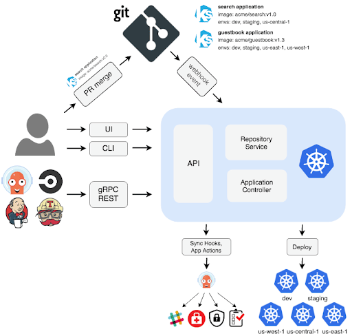

# About
Argo CD is a Kubernetes-native continuous deployment (CD) tool. Unlike external CD tools that only enable push-based deployments, Argo CD can pull updated code from Git repositories and deploy it directly to Kubernetes resources. It enables developers to manage both infrastructure configuration and application updates in one system.

# ArgoCD Features
- Manual or automatic deployment of applications to a Kubernetes cluster.
- Automatic synchronization of application state to the current version of declarative configuration.
- Web user interface and command-line interface (CLI).
- Ability to visualize deployment issues, detect and remediate configuration drift.
- Role-based access control (RBAC) enabling multi-cluster management.
- Single sign-on (SSO) with providers such as GitLab, GitHub, Microsoft, OAuth2, OIDC, LinkedIn, LDAP, and SAML 2.0
- Support for webhooks triggering actions in GitLab, GitHub, and BitBucket.

# GitOps with Argo CD
## High level developer works description
1. A developer makes changes to an application, pushing a new version of Kubernetes resource definitions to a Git repo.
2. Continuous integration is triggered, resulting in a new container image saved to a registry. 
3. A developer issues a pull request, changing Kubernetes manifests, which are created either manually or automatically.
4. The pull request is reviewed and changes are merged to the main branch. This triggers a webhook which tells Argo CD a change was made.
5. Argo CD clones the repo and compares the application state with the current state of the Kubernetes cluster. It applies the required changes to cluster configuration.
6. Kubernetes uses its controllers to reconcile the changes required to cluster resources, until it achieves the desired configuration.
7. Argo CD monitors progress and when the Kubernetes cluster is ready, reports that the application is in sync.
8. ArgoCD also works in the other direction, monitoring changes in the Kubernetes cluster and discarding them if they don’t match the current configuration in Git.

## ArgoCD Components
### GitOps agent
Argo CD is responsible for pulling updated code from Git repositories and deploying it directly to Kubernetes resources. It manages both infrastructure configuration and application updates in one system.

### Custom Resource Definitions (CRD)
Argo CD operates in its own namespace within a Kubernetes cluster.

### CLI
Argo CD offers a powerful CLI that lets you create YAML resource definitions with a few simple commands. 

### User Interface
Argo CD is unique in that it offers a convenient web-based UI that lets you do the same thing, define an application and ask Argo CD to create the relevant YAML configurations.

### Multi-tenancy
Argo CD has strong support for multiple teams working on different projects in the same Kubernetes environment.

### Leveraging existing tools
Argo CD aims to leverage existing declarative configurations based on YAML investments rather than replace them. It can use any of these formats to automatically create the relevant CRD definitions.

# How it works

When using Argo CD, you can specify application configuration using several types of Kubernetes manifests, including plain YAML or JSON manifest; Helm charts; Kustomize; and Ksonnet and Jsonnet applications. It is also possible to use any custom configuration management tool as a plugin.

Argo CD automatically deploys the desired state of an application in a specified target environment. Updates are traceable as tags, branches, or pinned specific versions of a manifest at Git commits.

Argo CD is a Kubernetes controller, responsible for continuously monitoring all running applications and comparing their live state to the desired state specified in the Git repository. It identifies deployed applications with a live state that deviates from the desired state as OutOfSync. Argo CD reports the deviations and provides visualizations to help developers manually or automatically sync the live state with the desired state. 

Argo CD can automatically apply any change to the desired state in the Git repository to the target environment, ensuring the applications remain in sync. 

## Repository Service
The internal repository service caches the Git repository locally, storing the application manifests. The repository server generates Kubernetes manifests and returns them based on inputs such as the repository URL, application path, revisions, and any template-specific settings.

## Application Controller
This component is a Kubernetes controller that continuously monitors applications, comparing the target state specified in the Git repository with the current state of each application. 

# Source
1. [IBM: What is ArgoCD](https://www.youtube.com/watch?v=p-kAqxuJNik) [eng]
2. [Что такое ArgoCD и как с ним работать в Kubernetes. GitOps](https://www.youtube.com/watch?v=KyaJX_litEM) [rus]
3. [Codefresh: Understanding Argo CD: Kubernetes GitOps Made Simple](https://codefresh.io/learn/argo-cd/) [eng]