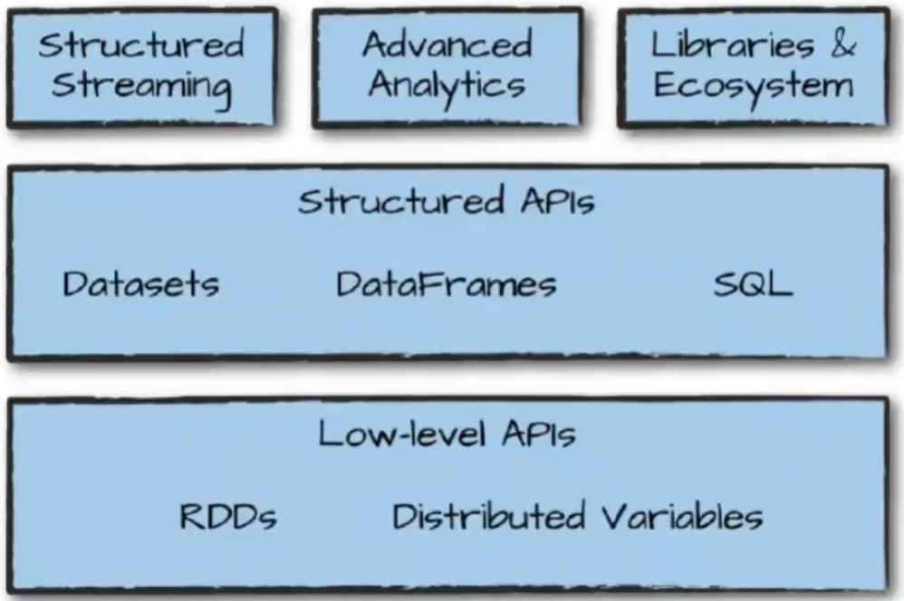
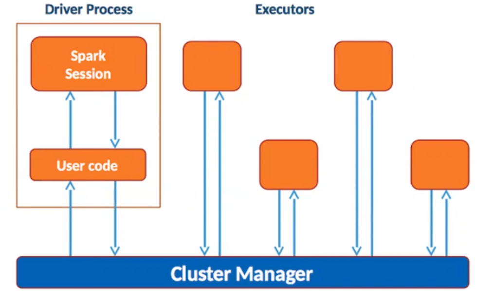
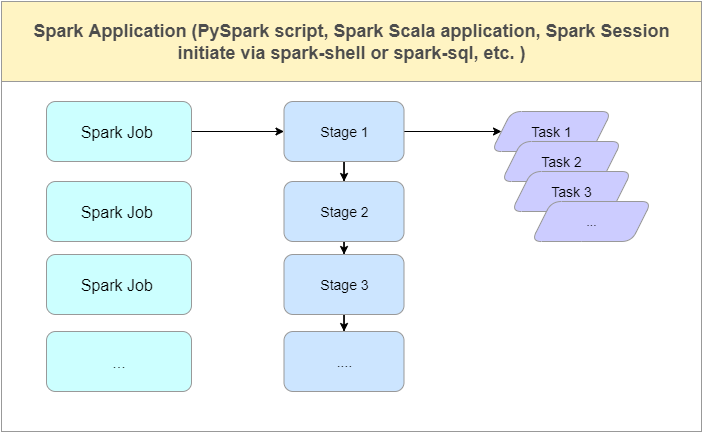
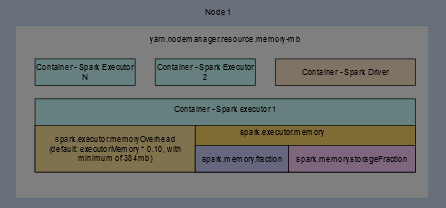

# About
Apache Spark is a data processing framework that can quickly perform processing tasks on very large data sets, and can also distribute data processing tasks across multiple computers, either on its own or in tandem with other distributed computing tools. These two qualities are key to the worlds of big data and machine learning, which require the marshalling of massive computing power to crunch through large data stores. Spark also takes some of the programming burdens of these tasks off the shoulders of developers with an easy-to-use API that abstracts away much of the grunt work of distributed computing and big data processing.

# Architecture


## RDD
At the heart of Apache Spark is the concept of the Resilient Distributed Dataset (RDD), a programming abstraction that represents an immutable collection of objects that can be split across a computing cluster. 

## SQL
Spark SQL has become more and more important to the Apache Spark project. It is the interface most commonly used by today’s developers when creating applications. Spark SQL is focused on the processing of structured data, using a dataframe approach borrowed from R and Python (in Pandas). But as the name suggests, Spark SQL also provides a SQL2003-compliant interface for querying data, bringing the power of Apache Spark to analysts as well as developers.

## MLlib and MLflow
Apache Spark also bundles libraries for applying machine learning and graph analysis techniques to data at scale. MLlib includes a framework for creating machine learning pipelines, allowing for easy implementation of feature extraction, selections, and transformations on any structured dataset.
An open source platform for managing the machine learning life cycle, MLflow is not technically part of the Apache Spark project, but it is likewise a product of Databricks and others in the Apache Spark community. 

## Structured Streaming
Structured Streaming is a high-level API that allows developers to create infinite streaming dataframes and datasets.

## Delta Lake
Like MLflow, Delta Lake is technically a separate project from Apache Spark. Over the past couple of years, however, Delta Lake has become an integral part of the Spark ecosystem, forming the core of what Databricks calls the Lakehouse Architecture.

# How it works


## Spark Application


The first concept to understand is Spark Application. An Spark application is a program built with Spark APIs and runs in a Spark compatible cluster/environment. It can be a PySpark script, a Java application, a Scala application, a SparkSession started by ```spark-shell``` or ```spark-sql``` command, a AWS EMR Step, etc. 

### Spark Job
A Spark job is a parallel computation of tasks. Each action operation will create one Spark job. 
Each Spark job will be converted to a DAG which includes one or more stages. 

### Spark Stage
A Spark stage is a smaller sets of tasks that depend on each other. Stages are created for each job based on shuffle boundaries, i.e. what operations can be performed serially or in parallel. Not all Spark operations or actions can happen in a single stage without data shuffling, thus they may be divided into multiple stages.

### Spark Task
A Spark task is a single unit of work or execution that runs in a Spark executor. It is the parallelism unit in Spark. Each stage contains one or multiple tasks. Each task is mapped to a single core and a partition in the dataset. 

## Spark Node


### Spark Driver
A Spark driver is the process where the main() method of your Spark application runs. It creates SparkSession and SparkContext objects and convert the code to transformation and action operations. It also create logical and physical plans and schedule and coordinate the tasks with Cluster Manager.

### Spark Executor
A Spark executor just simply run the tasks in executor nodes of the cluster. 

## Transformations and actions
When Spark driver container application converts code to operations, it creates two types: transformation and action.

### Transformation operations
Transformation operations are lazy executed and return a DataFrame, Dataset or an RDD. When we create a chain of transformations, no data will be executed until an action is called. Since it is lazy-evaluated, transformations will need to be recomputed in reuse unless data is cached or persisted. 

### Action operations
Actions will execute all the computation on the dataset to generate values that will be returned to the driver program. Transformation's output is an input of Actions.

# Source
1. [Школа больших данных: Spark](https://bigdataschool.ru/wiki/spark) [ru]
2. [Школа больших данных: Задания, задачи и этапы в Apache Spark](https://bigdataschool.ru/blog/jobs-tasks-and-stages-in-spark-apps.html) [ru]
3. [Школа больших данных: Apache Spark за 2 часа - для нетерпеливых](https://www.youtube.com/watch?v=xuMe6OFyQ2s&t=4s) [ru]
4. [InfoWorld: What is Apache Spark?](https://www.infoworld.com/article/3236869/what-is-apache-spark-the-big-data-platform-that-crushed-hadoop.html) [eng]
5. [Kontext: Spark Basics](https://kontext.tech/article/1166/spark-basics-application-driver-executor-job-stage-and-task-walkthrough) [eng]
